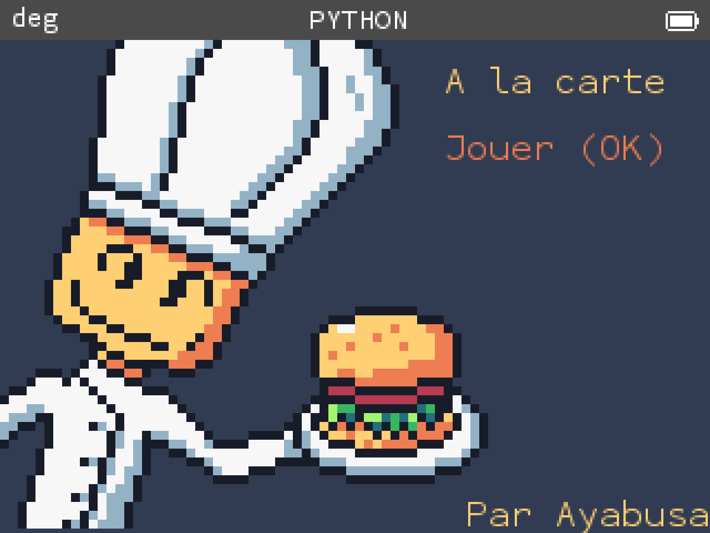
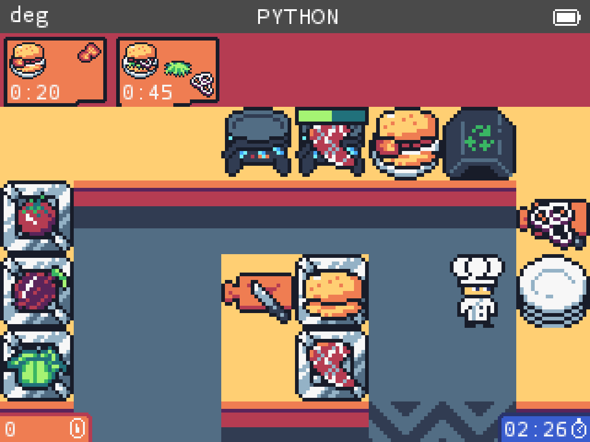

# A-la-carte
Jeu python pour la numworks réalisé pour le concours Ti Planet


## Comment jouer au jeu
> Attention ce jeu ne fonctionne que sur les OS tiers [Upsilon](https://getupsilon.web.app/) et [Omega](https://getomega.dev/).

Il vous suffit de télecharger le dernier fichier alacarte.py dans l'onglet [release](https://github.com/ayabusa/A-la-carte/releases) de ce repository, et de l'envoyer sur votre Numworks avec [Upsilon File Exchanger](https://yaya-cout.github.io/Numworks-connector/#/). Il ne vous reste ensuite plus qu'à le lancer sur la calculatrice ;D

## Comment """compiler""" le jeu
> Compiler est un grand mot car il s'agit en réalité plus de la génération des assets et d'un peu d'optimisation

> Il est à noter que le jeu passe à travers plusieurs phases d'optimisation, `game.py` n'est la que pour référence car le développement se fait maintentant dans `game_opti_stage1.py` où les noms de variables et de fonctions ont été raccourcis. Et enfin `game_opti_stage2.py` est la version finale, réellement illisible.
1. Clonez le repo avec `git clone https://github.com/ayabusa/A-la-carte.git` puis `cd A-la-carte`
2. Puis il faut encoder les sprites en lançant _converter.py ```python3 src/sprites/_converter.py```, et choisir l'option enregistrer dans un fichier
3. Ensuite copier le dictionnaire dans `src/sprites/sprites_converted.txt` et mettez le dans `src/game_opti_stage1.py` pour la variable sprites
4. Il est ensuite conseillé de rendre le script plus petit avec [python minifier](https://python-minifier.com/) et de mettre le résultat dans `src/game_opti_stage2.py`
5. Après avoir sauvegargé il ne vous reste plus qu'à envoyer le script sur votre numworks avec le [site de numworks](https://my.numworks.com/python) ou [celui d'Upsilon](https://yaya-cout.github.io/Numworks-connector)

## Me contacter
Vous pouvez m'envoyer un ptit dm sur Discord même si je ne suis pas toujours très actif: `@ayabusa_`
